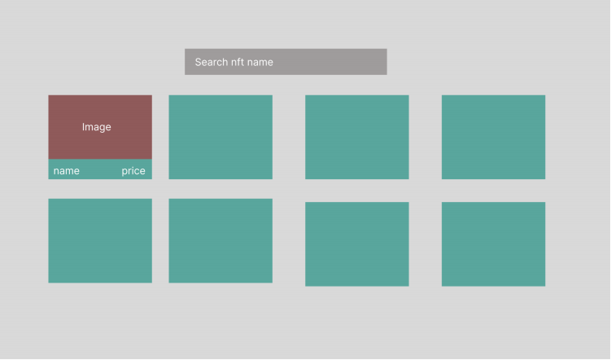
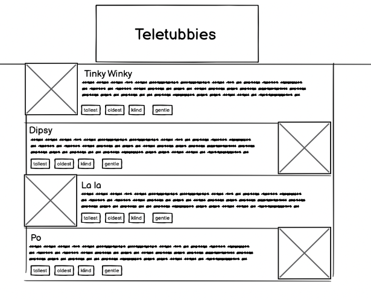

# Smart App

This is project using MUI with React.
The purpose is to practise the skill using the command of the Git.

# Tech stack

React, MUI

# How to run the project

```
npm install
npm start
```

# Requirements

## NFTs page

We have endpoints to return paginated NFT listings:

```
https://api-mainnet.magiceden.io/idxv2/getListedNftsByCollectionSymbol?collectionSymbol=okay_bears&limit=20&offset=0
```

Build a page with the following requirements:

- On load, show first 20 NFT listings in a grid, the grid should be responsive
- Each card will consist of an image, name, price
- Show more listing as user scrolls down the page
- Searh NFTs by name (frontend side)
- A design mock is as following:

  

## Teletubbies page

We have `teletubbies.json` in `public` directory.

Build a page with the following requirements:

- On load, show 20 teletubbies, it should be responsive
- Each card will consist of an image, name, description, tags
- Show more listing as user scrolls down the page
- Searh Teletubbies by name (frontend side)
- A design mock is as following:

  
